# Audit Flow (`/AUDIT`)

End-to-end codebase audit. The AUDITOR is a **planner and reporter** — it does NOT execute code changes itself. Phases 0–4 and 6 run in the AUDITOR. Phase 5 (execution) runs in the main session using the standard pipeline. A human gate sits between Phase 4 and Phase 5.

```mermaid
flowchart TD
    User([User: /AUDIT optional scope]) --> Main{{Main session}}
    Main -->|invoke| Auditor[AUDITOR<br/>opus — full tools]

    Auditor --> P0[Phase 0: Setup<br/>timestamp, audit dir,<br/>git SHA, branch,<br/>NestJS version, modules]

    P0 --> P1[Phase 1: Module review<br/>AUDITOR reads each module<br/>directly with Read/Glob/Grep<br/>writes reviews/ MODULE .md per module]

    P1 --> P2[Phase 2: Concern analysis<br/>cross-cutting passes:<br/>security / transactions /<br/>tests / architecture<br/>writes concern-analysis/ AREA .md]

    P2 --> P3[Phase 3: Plan generation<br/>writes plan.md<br/>P0/P1/P2 priority<br/>each item has owner agent,<br/>scope, curator-update flag]

    P3 --> P4[Phase 4: Human gate]
    P4 --> Surface[Main session surfaces<br/>plan to user]
    Surface --> UserGate{User decides}

    UserGate -->|reject| Auditor
    UserGate -->|modify| Modified[User edits plan items]
    UserGate -->|approve as-is| Save
    Modified --> Save[Main session saves<br/>plan-approved.md]

    Save --> P5[Phase 5: Execution<br/>main session drives,<br/>NOT the AUDITOR]

    P5 --> Item{For each plan item<br/>P0 → P1 → P2}

    Item --> Coder[NESTJS-CODER<br/>implements item]
    Coder --> Reviewer[NESTJS-REVIEWER<br/>structural review]
    Reviewer --> RevGate{Verdict?}
    RevGate -->|rejected,<br/>< 3 rounds| Coder
    RevGate -->|rejected,<br/>budget exceeded| MasterEsc[Escalate to MASTER<br/>via delegation request]
    RevGate -->|approved| Tester[NESTJS-TESTER<br/>runs tests]
    Tester --> TestGate{Passed?}
    TestGate -->|failed,<br/>< 2 rounds| Coder
    TestGate -->|failed,<br/>budget exceeded| MasterEsc
    TestGate -->|passed| CurFlag{curator-update<br/>flag set?}
    CurFlag -->|no| LogItem
    CurFlag -->|yes| Curator[CONTEXT-CURATOR<br/>updates wiki]
    Curator --> WikiRev[NESTJS-REVIEWER<br/>reviews wiki diff]
    WikiRev --> WikiGate{Verdict?}
    WikiGate -->|rejected| Curator
    WikiGate -->|approved| LogItem

    LogItem[Append to<br/>execution-log.md] --> NextItem{More items?}
    NextItem -->|yes| Item
    NextItem -->|no, all done| ReinvokeAuditor

    MasterEsc --> Surface

    ReinvokeAuditor[Main session re-invokes<br/>AUDITOR with:<br/>'Resume audit ts at Phase 6']
    ReinvokeAuditor --> P6[Phase 6: Reports<br/>AUDITOR reads execution-log.md<br/>writes reports/ security.md,<br/>code.md, architecture.md]
    P6 --> Done([Surface final reports<br/>to user])

    classDef auditor fill:#ede7f6,stroke:#512da8,stroke-width:2px,color:#000
    classDef agent fill:#e1f5ff,stroke:#0288d1,stroke-width:2px,color:#000
    classDef gate fill:#fff3e0,stroke:#f57c00,stroke-width:2px,color:#000
    classDef human fill:#f3e5f5,stroke:#7b1fa2,stroke-width:2px,color:#000
    classDef escalate fill:#ffebee,stroke:#c62828,stroke-width:2px,color:#000
    classDef done fill:#e8f5e9,stroke:#2e7d32,stroke-width:2px,color:#000
    classDef phase fill:#fffde7,stroke:#f9a825,stroke-width:2px,color:#000

    class Auditor auditor
    class Coder,Reviewer,Tester,Curator,WikiRev agent
    class RevGate,TestGate,CurFlag,WikiGate,UserGate,NextItem,Item gate
    class Surface,Modified human
    class MasterEsc escalate
    class Done done
    class P0,P1,P2,P3,P4,P5,P6,Save,LogItem,ReinvokeAuditor phase
```

## Why this shape

Subagent-to-subagent invocation via Task is **not supported** in current Claude Code. Earlier audit designs that had the AUDITOR spawn coder/reviewer/tester subagents silently degraded to the AUDITOR doing all the work itself — losing the independent reviewer gate.

The current design:
- Phases 0–3 stay in the AUDITOR (planning + analysis is a single agent's job).
- Phase 4 is the human gate (user reviews and approves the plan).
- **Phase 5 returns to the main session**, which uses the proven standard-pipeline pattern per item.
- Phase 6 re-invokes the AUDITOR with the execution log so it can write the final reports.

## Phase-by-phase ownership

| Phase | Owner | What happens |
|---|---|---|
| 0 — Setup | AUDITOR | Timestamp, audit dir, git SHA, NestJS version, module discovery |
| 1 — Module review | AUDITOR | Read each module, apply LLD §16 checklist, write `reviews/<module>.md` |
| 2 — Concern analysis | AUDITOR | Cross-cutting passes (security, transactions, tests, architecture) |
| 3 — Plan generation | AUDITOR | `plan.md` with prioritized items + owner + scope + curator flag |
| 4 — Human gate | AUDITOR → main → user | Plan presented, user approves/modifies, `plan-approved.md` saved |
| **5 — Execution** | **Main session** | **Item-by-item via standard pipeline; AUDITOR is dormant** |
| 6 — Reports | AUDITOR (re-invoked) | Reads `execution-log.md`, writes 3 reports |

## Loop budgets in Phase 5

Same as the standard pipeline, applied **per plan item**:
- Coder ↔ Reviewer: max 3 rounds → escalate to MASTER (delegation request)
- Coder ↔ Tester: max 2 rounds → escalate to MASTER (delegation request)

If a single item exceeds budget, the main session surfaces the escalation to the user.

## What NOT to do during Phase 5

- **Do not invoke the AUDITOR.** Its job is done until Phase 6.
- **Do not skip the reviewer pass.** That's the whole reason Phase 5 lives in the main session.
- **Do not run plan items in parallel.** They often have dependencies; sequential execution avoids merge complexity.
- **Do not re-engage the user gate per item.** The plan was approved as a whole; surface only on stalled loops or unanticipated scope changes.
