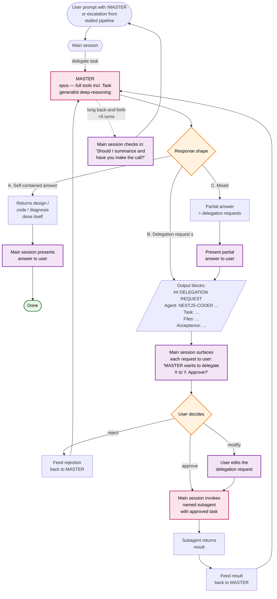

# MASTER Flow (`/MASTER`)

For tough, ambiguous, or open-ended problems — deep architecture decisions, cross-module debugging, novel design problems, or stalled standard-pipeline loops. MASTER (opus) reasons through the problem and either self-contains the answer or asks the main session to delegate sub-tasks. **MASTER never invokes other subagents directly** — every delegation request is gated by user approval.

## Why the delegation gate matters

MASTER runs on opus and can request work from any standard agent. Without the gate:
- A single MASTER call could trigger dozens of opus + sonnet calls without user awareness.
- The user loses visibility into cost and direction.
- The "stalled pipeline rescue" use case becomes another runaway loop.

The gate keeps the user in the loop on every cost-significant delegation.

## When MASTER does the work itself vs. delegates

| Situation | MASTER's action |
|---|---|
| Reading code to understand it | does it itself |
| Designing a new module's structure | does it itself |
| Writing the actual code for that module | delegates to NESTJS-CODER |
| Reviewing tricky code | does it itself if regular reviewer already approved |
| Running tests | always delegates to NESTJS-TESTER |
| Updating wikis | delegates to CONTEXT-CURATOR |
| Debugging a hard runtime issue | does it itself |
| Researching unfamiliar library | does it itself with WebFetch / WebSearch |

The rule: judgment work stays with MASTER; mechanical work delegates.

## Output shapes MASTER uses

| Task type | Expected MASTER output |
|---|---|
| Design questions | reasoning + recommendation + delegation requests for implementation |
| Hard bugs | diagnosis + fix (or delegation request) + how to prevent recurrence |
| Architecture work | mermaid diagram + explanation + file/module skeleton |
| Stalled-loop rescue | why it stalled + what to do differently + fresh delegation request |

Every MASTER response ends with a `## What's next` section listing concrete next actions and owners.
