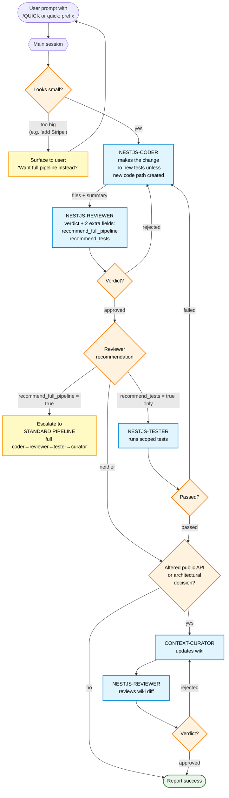

# Fast-Path Flow (`/QUICK`)

For small changes — renames, parameter tweaks, signature adjustments, comment updates. Skips the full pipeline. Coder makes the change; reviewer judges whether tests / full pipeline / curator are needed.



## Reviewer's extra responsibility on `/QUICK`

On a fast-path review, the reviewer's JSON includes two extra fields beyond the usual verdict:

```json
{
  "verdict": "approved",
  "issues": [],
  "recommend_full_pipeline": false,
  "recommend_tests": false,
  "summary": "Pure rename, no new behaviour"
}
```

The main session reads these to decide whether to escalate, run tests only, or stop.

## When to honour `/QUICK` vs. surface a question

| Looks like… | Action |
|---|---|
| Rename / parameter tweak / signature adjust | honour `/QUICK` |
| Comment / log message update | honour `/QUICK` |
| New endpoint / new module / new dependency | surface — recommend standard pipeline |
| Bug fix that needs a regression test | honour `/QUICK` initially; reviewer will flag `recommend_tests=true` |
