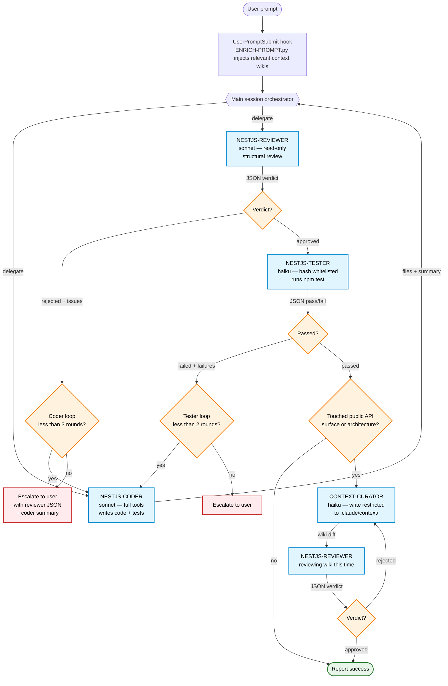

# Standard Pipeline Flow

Default flow for any "implement X" / "fix Y" / "refactor Z" prompt that isn't explicitly routed elsewhere.

The order is **CODE → REVIEW → TEST → CURATE** — not CODE → TEST → REVIEW. Static review is cheap (sonnet, read-only); tests are expensive (DB, network). Reject early, reject cheap.

## Loop budgets

- Coder ↔ Reviewer: **max 3 rounds** before escalation to user.
- Coder ↔ Tester: **max 2 rounds** before escalation to user.

## When steps are skipped

| Task type | Coder | Reviewer | Tester | Curator |
|---|---|---|---|---|
| New feature | ✅ | ✅ | ✅ | ✅ |
| Bug fix (with regression test) | ✅ | ✅ | ✅ | ❓ skip if module-API unchanged |
| Refactor (no behaviour change) | ✅ | ✅ | ✅ | ❌ |
| Doc-only change | ✅ | ❌ | ❌ | ❌ |
| Test-only addition | ✅ | ✅ | ✅ | ❌ |
| Config / dependency bump | ✅ | ✅ | ✅ (full suite) | ❌ |
